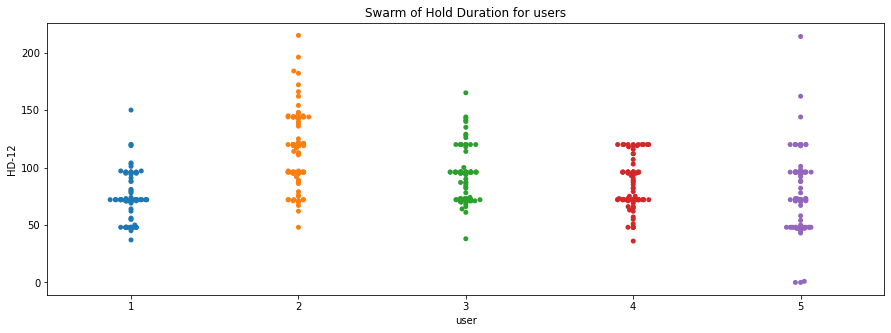

# KeyStroke аутентификация

> [!TIP]
> **KeyStroke аутентификация** - технология аутентификации, которая определяет личность пользователя за клавиатурой за счет разбора его манеры печати. 

 

## Содержание

[0. Мотивация](#0)

[1. Пример запуска](#1)

Создание новых данных о способе печати человека

Сравнение печати с имеющимися данными (аутентификация)

[2. Идея метода](#2)

<a name="0"></a>
## Мотивация

Предлагаемый нами метод `аутентификации пользователей по динамике ввода пароля` предпочтителен по сравнению с другими по ряду причин. 
- Во-первых, этот метод более удобен для пользователя по сравнению с другими методами многофакторной аутентификации (e-mail, телефон).
- Во-вторых, этот метод доступнее и дешевле в реализации по сравнению с другими методами (например - биометрическими), которые требуют дополнительных датчиков и устройств.

Поведение набора текста на клавиатуре можно использовать как уникальную характеристику каждого пользователя. На сегодняшний день существует ряд исследований, показывающих, что что при помощи такой характеристики может быть распознан пользователь либо злоумышленник. Примеры таких работ - [[1]](https://www.sciencedirect.com/science/article/pii/S0167404814000893), [[2]](https://www.iaeng.org/publication/IMECS2018/IMECS2018_pp399-404.pdf), [[3]](https://dl.acm.org/doi/10.1145/1978942.1979046)

<a name="1"></a>
## Пример запуска

> [!IMPORTANT]
> Для запуска необходима X windowing system с включенным расширением RECORD. Такая есть, например, в терминале Visual Studio Code.

Программа работает в **двух** режимах:

* Создание новой записи о стиле печати
* Аутентификация


### Создание новых данных

Создадим новую запись о нашем стиле печати:

```bash
$ python keystroke_authetication.py
```
```
Choose action:
  1. Write new data.
  2. Match text to a existing data.
1


What is your name? lola
Write this text. In the end press Ctrl+C.
_________________________________________
Info sec best!
Info sec best!^C

Your data created sucsessfully!
```
После этого в директории *data* будут созданы два файла:

* *lola.keypresses* - сырая информация о нажатиях на клавиши.
* *lola.fingerprint* - обработанная информация, пригодная для сравнения двух пользователей.

### Аутентификация

Введём текст и система определит с каким пользователем наиболее схожа ваша манера печати.

```bash
$ python keystroke_authetication.py
```
```
Choose action:
  1. Write new data.
  2. Match text to a existing data.
2


Write this text. In the end press Ctrl+C.
_________________________________________
Info sec best!
Info sec best!^C


Comparing with existing data.

Mark for slow_bob: 1.4324825249192017e-59.
Mark for fast_alice: 9.684491491533758e-25.
Mark for lola: 0.0007962996554552582.

You are:  lola
```
**Правильно!**

-----------------------------------------------------------------------------

 
 <a name="2"></a>
 ## Идея метода

На картинке изображены времена, которые могут быть измерены с помощью расширения RECORD оконной системы X. У каждого человека свои значения времени нажатия клавиши и задержки между нажатиями двух клавиш. По этим данным можно сконструировать **почерк** (численное описание) человека. Для его последующего распознавания можно любым известным алгоритмом выбирать наиболее похожие **почерки** и решать действительно ли это валидный пользователь.

 

## Детали реализации

Наш анализ поведения гостя состоит из следующих этапов:
[1. Логгирование нажатий](#log)
[2. Извлечение признаков (features) из нажатий](#feature)
[3. Построение модели гостя](#model)
[4. Предсказание](#predict)

<a name="log"></a>
### Логгирование нажатий

Чтобы собирать данные о нажатиях, мы используем **Xlib**.
Пример данных, которые мы достаём из Xlib:

```
(50, 0, 21755334), (31, 0, 21755854), (31, 1, 21756009), (50, 1, 21756096)
```

Формат: (код клавиши, состояние: нажата / отжата, время события)

<a name="feature"></a>
### Извлечение признаков

Далее мы извлекаем из данных признаки.

Согласно анализу [открытого датасета](https://www.kaggle.com/competitions/keystroke-dynamics-challenge-1/data), время удержания клавиш может значительно варьироваться между пользователями.



Поэтому из данных, полученных из Xlib, мы высчитываем время удержания клавиши (**dwell time**),
т.е. время между *нажатием* и *отжатием* конкретной клавиши.

Пример:
Клавиша с кодом 65 была нажата несколько раз, каждый раз время удержания слегка отличалось.
```
(65, [111, 107, 89, 113, 123, 102, 121, 124])
```

<a name="model"></a>
### Построение модели

Мы предполагаем, что время удержания клавиши имеет гауссово распределение.
На этом шаге подсчитываются среднее и дисперсия *dwell time* каждой использованной клавишы.

<a name="predict"></a>
### Предсказание

Далее мы производим сверку полученной модели с базой данных, которая была
составлена на основании поведения истинного хозяина устройства.

Фактически, для каждой буквы мы сравниваем гауссовы распределения гостя и истинного хозяина. 
Затем считаем насколько они *похожи*.
Затем суммируем по всем буквам и получаем итоговый *скор*.

Этот *скор* - метрика похожести гостя и хозяина.

Если скор очень маленький, это значит что поведение гостя не похоже на поведение хозяина.
В таком случае можно запросить дополнительную аутентификацию / заморозить банковские операции / как
угодно иначе отреагировать на вторжение.
