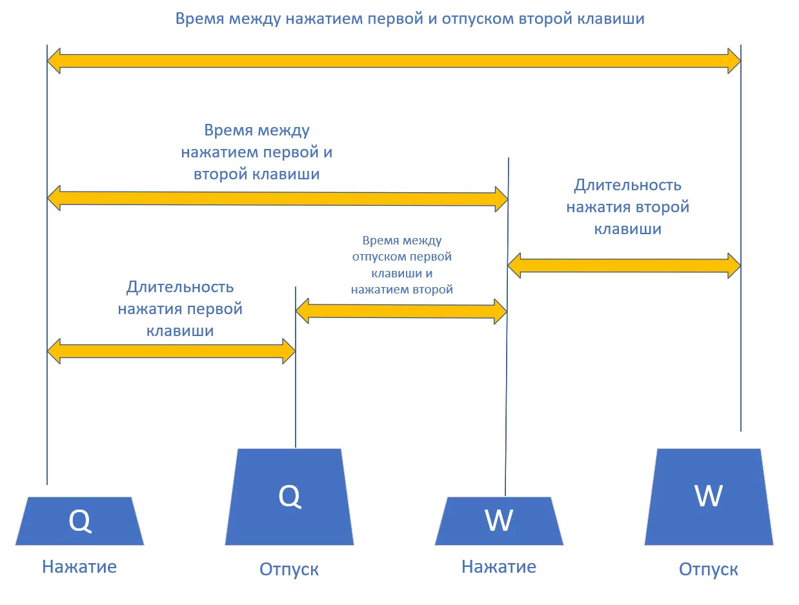

# KeyStroke аутентификация

> [!TIP]
> **KeyStroke аутентификация** - технология аутентификации, которая определяет личность пользователя за клавиатурой за счет разбора его манеры печати. 

 


## Содержание

[1. Пример запуска](#1)

Создание новых данных о способе печати человека

Сравнение печати с имеющимися данными (аутентификация)

[2. Идея метода](#2)


<a name="1"></a>
## Пример запуска

> [!IMPORTANT]
> Для запуска необходима X windowing system с включенным расширением RECORD. Такая есть, например, в терминале Visual Studio Code.


### Создание новых данных и аутентификация

Программа работает в двух режимах:

* Создание новой записи о стиле печати
* Аутентификация

Создадим новую запись о нашем стиле печати:

```
$ python keystroke_authetication.py
```
-----------------------------------------------------------------------------

 
 <a name="2"></a>
 ## Идея метода

На картинке изображены времена, которые могут быть измерены с помощью расширения RECORD оконной систему X. У каждого человека свои значения задержки между нажатиями двух клавиш. По данным о времени нажатия клавиш и времени задержки между двумя клавишами можно сконструировать "почерк" (численное описание) человека. Для его последующего распознавания можно любым известным алгоритмом выбирать наиболее похожие "почерки" и решать действительно ли это валидный пользователь.

 


